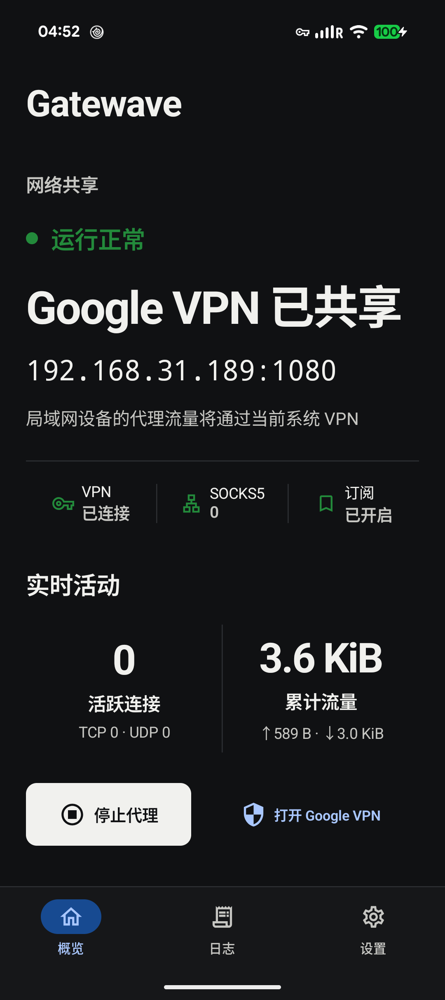
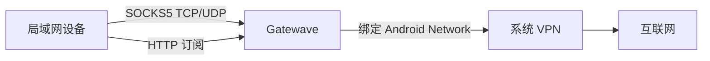

<p align="center">
  
</p>

<h1 align="center">Gatewave</h1>

<p align="center">把 Android 手机当前的系统 VPN 安全共享给同一局域网中的设备。</p>

<p align="center">
  <a href="https://github.com/hexf11/Gatewave/releases/latest">下载最新版</a> ·
  <a href="https://github.com/hexf11/Gatewave/issues">问题反馈</a> ·
  <a href="SECURITY.md">安全策略</a>
</p>

## 项目简介

Gatewave 是一个运行在 Android 手机上的局域网 SOCKS5 网关。它接收同一 Wi-Fi 子网中的 TCP 和 UDP 请求，并把上游连接绑定到手机当前的系统 VPN 网络。

它适合以下场景：

- 手机已经连接系统 VPN，希望电脑、平板或电视复用该出口。
- 希望通过 Clash、Mihomo、Stash 等客户端按规则分流。
- 希望在 VPN 暂停时立即停止转发，避免流量回落到普通网络。
- 希望通过一个局域网订阅链接自动获得完整 Clash 配置。

<p align="center">
  
</p>

## 主要功能

- SOCKS5 `CONNECT` 与 `UDP ASSOCIATE`。
- SOCKS5 握手、上游建连、TCP 转发和 UDP 转发均使用共享 NIO Selector，不再按连接常驻线程。
- Pixel 级设备支持动态 1024 会话、1024 accept backlog 和 128 个 UDP 关联；资源较小的设备自动降低上限。
- 多客户端使用动态公平份额；单设备可使用空闲容量，满载时后到设备仍能从占用过量的客户端获得会话。
- TCP 使用 O(1) 空闲时间轮、8–64 KiB 自适应 DirectBuffer、背压与半关闭排空窗口。
- 提供均衡、极速、省电三档模式；极速模式启用 8 MiB 上游 TCP 接收窗口与 Wi-Fi 低延迟锁，温度严重时自动降级并回收缓冲池。
- VPN DNS 使用 60 秒短缓存并合并同域名并发查询，VPN 切换时立即失效。
- IPv4/IPv6 地址以 250 ms Happy Eyeballs 竞速，失败地址按当前 VPN 网络独立降级。
- TCP DirectBuffer 按需分配并在 Selector lane 内复用，空闲连接不预留转发缓冲区。
- 状态计数为常数时间，并对磁盘持久化和通知栏刷新做了节流。
- 上游 TCP、UDP 和域名解析全部绑定系统 VPN。
- VPN 中断时关闭现有会话并暂停转发。
- 只接受回环地址和当前私有局域网中的客户端。
- 阻止私有、链路本地和回环目标，避免代理循环。
- 可配置 SOCKS5 端口、订阅端口和 UDP 转发。
- 提供 Clash YAML 订阅、链接复制、分享和二维码。
- 提供 TCP、UDP、订阅、VPN、出口地址、VPN RTT、单流/4 流吞吐和数据面容量等一键网络自检；分享报告隐藏具体网络地址。
- 提供峰值、活跃设备、DNS、建连 P50/P95、实时吞吐、UDP 快路径/解析/队列峰值/丢弃、公平回收、Selector 与缓冲池指标。
- 支持开机启动、打开应用时启动、VPN 恢复后自动继续。
- 使用 Kotlin、Jetpack Compose 和 Material 3。
- 适配 Android 16 的边到边显示与前台服务行为。

## 网络结构



## 系统要求

- Android 8.0 或更高版本。
- 手机已经连接一个可用的系统 VPN。
- 手机与客户端处于同一 Wi-Fi 私有子网。
- 客户端支持 SOCKS5，或支持从 URL 导入 Clash 配置。

## 安装

从 [GitHub Releases](https://github.com/hexf11/Gatewave/releases/latest) 下载签名 APK，然后在 Android 手机上安装。

首次使用时：

1. 连接系统 VPN。
2. 打开 Gatewave，点击“启动代理”。
3. 在局域网客户端填写手机显示的 IP 地址和端口，默认端口为 `1080`。
4. 如需 Clash 订阅，在设置中开启“局域网订阅链接”，默认端口为 `8080`。

## Clash 节点示例

```yaml
proxies:
  - name: Gatewave
    type: socks5
    server: 192.168.X.X
    port: 1080
    udp: true
```

## Clash 订阅

Gatewave 开启订阅后会显示类似下面的地址：

```text
http://192.168.X.X:8080/clash.yaml
```

在 Clash、Mihomo 或 Stash 中选择“从 URL 导入”，粘贴该地址即可。订阅服务只接受当前 Wi-Fi 私有子网中的请求，并返回包含局域网直连、中国大陆直连和常见海外服务代理规则的完整 YAML。

## 从源码构建

准备环境：

- JDK 17
- Android SDK 36.1
- Android Build Tools 36.1.0

调试构建：

```bash
./gradlew --no-daemon lintDebug assembleDebug
```

产物位置：

```text
app/build/outputs/apk/debug/app-debug.apk
```

本地签名构建需要在仓库根目录创建被忽略的 `keystore.properties`：

```properties
storeFile=/绝对路径/gatewave-release.p12
storePassword=密钥库密码
keyAlias=gatewave
keyPassword=密钥密码
```

然后执行：

```bash
./gradlew --no-daemon clean lintRelease assembleRelease bundleRelease
```

## 安全与隐私

- Gatewave 不上传账号、浏览记录或代理流量。
- 代理默认监听全部本地接口，但会在应用层校验客户端是否属于私有局域网。
- 订阅服务只允许当前 Wi-Fi 子网访问。
- VPN 不可用时，Gatewave 会暂停转发并关闭现有会话。
- 本项目不包含任何发布签名密钥；正式构建通过 GitHub Actions 加密变量注入签名材料。

发现安全问题时，请按照 [安全策略](SECURITY.md) 私下报告。

## 开发与贡献

提交代码前请阅读 [贡献指南](CONTRIBUTING.md) 和 [行为准则](CODE_OF_CONDUCT.md)。版本变化记录见 [更新日志](CHANGELOG.md)。

高并发容量、Selector、缓冲、时间轮、公平配额与性能模式的实现说明见 [性能架构](docs/performance.md)。

## 项目关系说明

Gatewave 是独立开源项目，与 Google、Pixel、Clash、Mihomo 或 Stash 的开发团队不存在隶属或官方合作关系。相关名称仅用于说明兼容场景。

## 许可证

本项目采用 [Apache License 2.0](LICENSE) 开源许可证。
